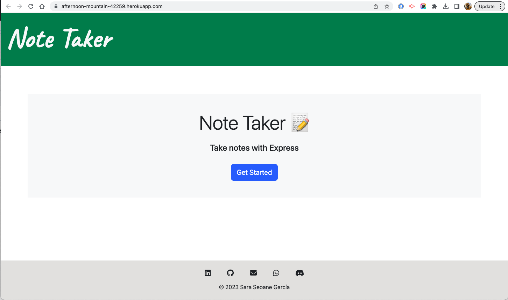

# Note taker

## Description

This application can be used to write and save notes. The application uses and Express.js back end and saves and retrieves note data from a JSON file.

## Table of Contents

- [Installation](#installation)
- [Usage](#usage)
- [Screenshots](#screenshots)
- [Deployment](#deployment)
- [Credits](#credits)
- [License](#license)

## Installation

Ensure that you have Node.js installed, v16 is best. You can follow [this](https://coding-boot-camp.github.io/full-stack/nodejs/how-to-install-nodejs) guide for installation instructions.

Clone this repository:

>`git clone git@github.com:sarasg89/the-burlington-note-factory.git`

Navigate into the directory where you cloned this repository:

>`cd ./the-burlington-note-factory`

Run npm install to retrieve dependencies:

>`npm install`

## Usage

Open your terminal and navigate to the directory

>`cd ./the-burlington-note-factory`

Run node to initialize the application

>`npm start`

### Screenshots

## Deployment

This application has been deployed with Heroku, you can access it [here](https://afternoon-mountain-42259.herokuapp.com/).

## Credits

Starter code found in the [miniature-eureka repo](https://github.com/coding-boot-camp/miniature-eureka).

I searched several threads in Stack Overflow looking for a way to delete existing notes, in the end I found [this](https://stackoverflow.com/a/65028533) answer provided the best solution.

I followed [these instructions](https://stackoverflow.com/a/37885428) to create a default GET route.

## License

MIT License

Copyright (c) 2023 sarasg89

Permission is hereby granted, free of charge, to any person obtaining a copy of this software and associated documentation files (the "Software"), to deal in the Software without restriction, including without limitation the rights to use, copy, modify, merge, publish, distribute, sublicense, and/or sell copies of the Software, and to permit persons to whom the Software is furnished to do so, subject to the following conditions:

The above copyright notice and this permission notice shall be included in all copies or substantial portions of the Software.

THE SOFTWARE IS PROVIDED "AS IS", WITHOUT WARRANTY OF ANY KIND, EXPRESS OR IMPLIED, INCLUDING BUT NOT LIMITED TO THE WARRANTIES OF MERCHANTABILITY, FITNESS FOR A PARTICULAR PURPOSE AND NONINFRINGEMENT. IN NO EVENT SHALL THE AUTHORS OR COPYRIGHT HOLDERS BE LIABLE FOR ANY CLAIM, DAMAGES OR OTHER LIABILITY, WHETHER IN AN ACTION OF CONTRACT, TORT OR OTHERWISE, ARISING FROM, OUT OF OR IN CONNECTION WITH THE SOFTWARE OR THE USE OR OTHER DEALINGS IN THE SOFTWARE.
